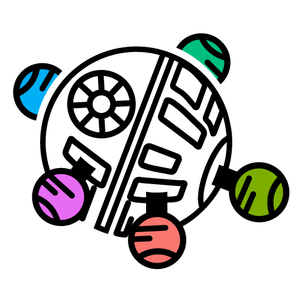

# Welcome to DevStart-Hub 👋 </a>

  DevStart-Hub is the new home for our growing ecosystem of developmental research tools.  
  We created this organization to centralize and expand upon our original project,  
  <a href="https://tommasoghilardi.github.io/DevStart">DevStart</a>. Our immediate goal is to gradually  
  migrate all the resources currently available on the DevStart website to this new organization,  
  creating a more structured and comprehensive platform. Beyond this migration, we’re excited to  
  expand the project in new directions and explore innovative approaches to developmental research  
  tools. Stay tuned as we continue to build and grow this community resource!

 

  

  <i><small>
    Have questions about developmental psychology research?  
    Working on similar topics? Just want to chat about science?  
    Feel free to reach out!
  </small></i>

<table align="center" style="margin-top: 10px; border-collapse: collapse;">
  <tr>
    <td style="padding: 0 15px; text-align: center;">
      <a href="mailto:t.ghilardi@bbk.ac.uk">t.ghilardi@bbk.ac.uk</a>
    </td>
    <td style="padding: 0 15px; text-align: center;">
      <a href="mailto:Francesco.Poli@mrc-cbu.cam.ac.uk">Francesco.Poli@mrc-cbu.cam.ac.uk</a>
    </td>
    <td style="padding: 0 15px; text-align: center;">
      <a href="mailto:g.serino@bbk.ac.uk">g.serino@bbk.ac.uk</a>
    </td>
  </tr>
</table>

